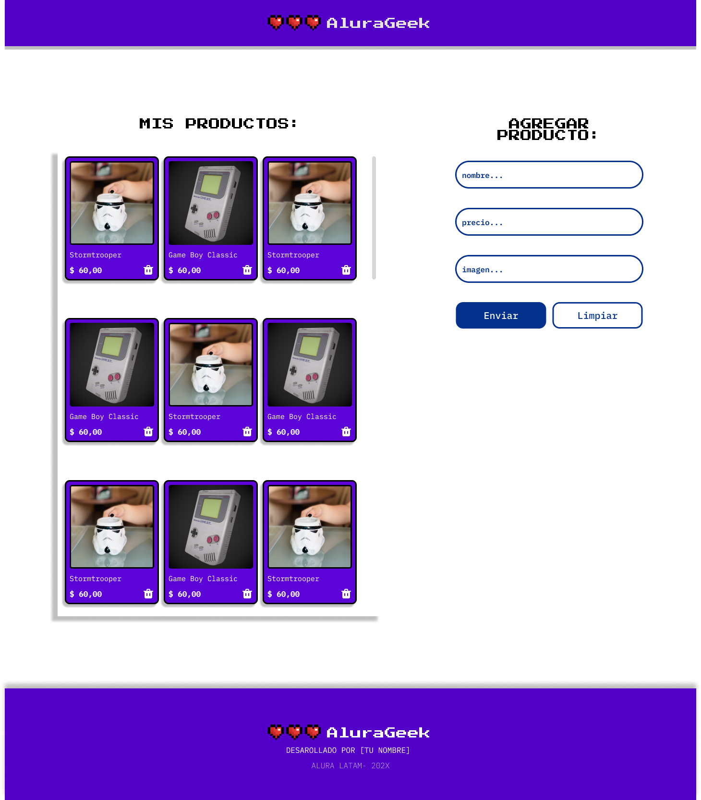

<h1>alura-geek</h1>

Alura geek is the final project for the Front End formation from Alura ONE program.

This project is intended to put to the test the skills acquired throughout the formation, such as CSS flexbox, DOM manipulation, API requests, HTTP methods, and form validation.

 
